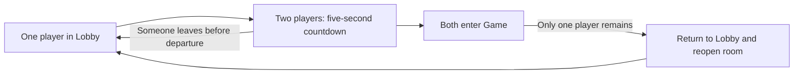
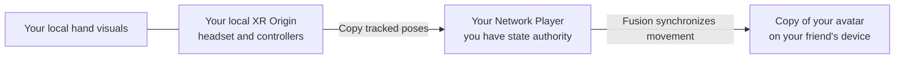
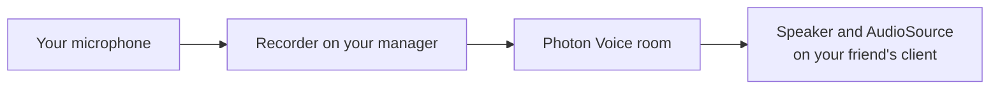
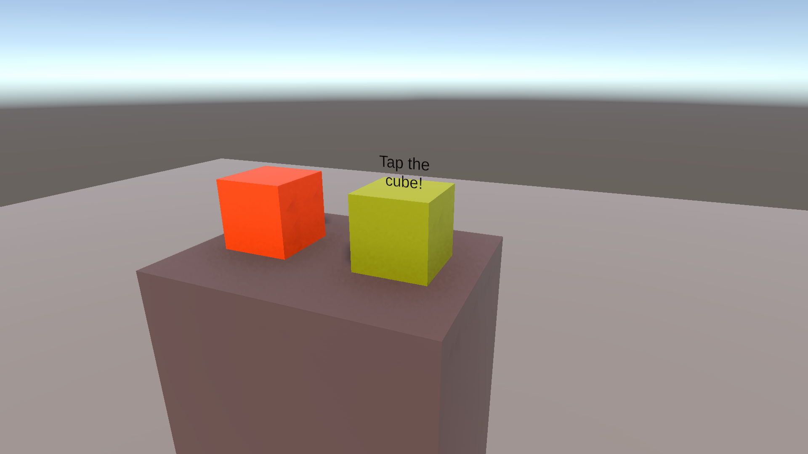

# Learn Photon Fusion by building a multiplayer VR game

Imagine opening a VR game, meeting a friend in a waiting room, and entering a shared play space together. You can see their hands move, hear them speak, and take turns picking up a cube. This project uses that small experience to explain how multiplayer VR works: **XR Interaction Toolkit (XRI)** handles local VR interaction, **Photon Fusion** shares game state between players, and **Photon Voice** carries their speech.

This is a guided tour of the **project supplied in this repository**. The scenes, prefabs, and scripts are already supplied; you do not need to create them again as you read. Each section starts with what we want the player to experience and why it needs a particular networking approach, then walks through how this project implements it. You should be comfortable opening a Unity scene, finding a component in the Inspector, and reading basic C#. Photon concepts are introduced along the way.


*Our destination: two simple objects that teach different networking ideas. Orange teaches who may move an object; yellow-green teaches how an interaction reaches other players. The scene images in this guide are offline Unity previews, not recordings of a connected multiplayer session.*

## Before you begin

Open the repository as a project through Unity Hub and allow the packages to import. The project uses **Unity 6000.3.23f1**, with Fusion included under `Assets/Photon`; XRI **3.3.2** and the Voice integration are declared in `Packages/manifest.json`. Use the project's package configuration when following along.

For the complete experience, you need two running copies of the game with working VR input and an internet connection. Two players with headsets and controllers let you check tracking, grabbing, and voice together. One connected copy is enough to check that the waiting room works, but it will stay there until another player joins. An Editor run counts as a client too; it still needs working XR input for the interaction exercises. This guide assumes your headset already works with the project's XR setup.

Follow the sections in order on your first pass:

1. [Connect to the same room](#1-connect-to-the-same-room).
2. [Wait for a friend and start together](#2-wait-for-a-friend-and-start-together).
3. [Make each player visible](#3-make-each-player-visible).
4. [Let players talk](#4-let-players-talk).
5. [Take turns moving the orange cube](#5-take-turns-moving-the-orange-cube).
6. [Share an interaction on the yellow-green cube](#6-share-an-interaction-on-the-yellow-green-cube).
7. [Return to the waiting room and try the whole journey](#7-return-to-the-waiting-room-and-try-the-whole-journey).

## 1. Connect to the same room

### What we want, and why

We want both players to enter the same shared space. Each device runs its own copy of Unity, with its own scene and objects. Changing something on one device does not automatically change it on the other. Networking connects those copies and carries the information we choose to share. In this guide, **local** means “on my device,” **remote** means “on another player's device,” and a **client** or **peer** is one connected copy of the game.

There are two levels to finding each other. The **Photon App ID** identifies the application, while the **session name** identifies a room within it. This project uses Fusion's **Shared mode**, where different clients can control different network objects. That suits our first goal: each player controls their own avatar, and later either player can take control of a shared cube. Joining a session establishes the connection; creating avatars is a separate step.

### How this project does it

First, create a **Fusion** application in the [Photon Dashboard](https://dashboard.photonengine.com/). In Unity's Project window, select `Assets/Photon/Fusion/Resources/PhotonAppSettings.asset` and enter its ID in **App Id Fusion**. Voice is optional: create a separate **Voice** application and enter its ID in **App Id Voice** if you want speech. Both players must use the same application IDs and matching connection settings, including region and app version.

Open `Assets/Scenes/Lobby Scene.unity`. In **File → Build Profiles → Scene List**, check that **Lobby Scene** is enabled at index `0` and **Game Scene** at index `1`. The controller refers to these scenes by number, so their order matters. Start the multiplayer experience from Lobby; opening Game directly does not run this connection flow.

For a first connection check, open Lobby and press Unity's **Play** button. For the two-player exercises, build the project for your configured headset platform through Build Profiles and run it on both players' devices, or use one headset-connected Editor run and one separate build. Make the configuration changes below before building, so both copies have the same settings. Our **Lobby Scene** is a waiting area inside an already joined session; it is different from Photon's matchmaking lobby used to discover rooms.

In Lobby's Hierarchy, select **Fusion Network Manager**. Its `NetworkRunner` manages this client's Fusion connection and simulation. [FusionNetworkManager.cs](Assets/Fusion%20and%20Essential%20Spawned%20Player%20Stuffs/Scripts/FusionNetworkManager.cs) prepares these arguments and passes them to `runner.StartGame(...)`:

```csharp
var startGameArgs = new StartGameArgs
{
    GameMode = GameMode.Shared,
    SessionName = SessionName,
    PlayerCount = MaxPlayers,
    Scene = SceneRef.FromIndex(lobbySceneIndex),
    SceneManager = GetComponent<NetworkSceneManagerDefault>()
};
```

Here, **Session Name** defaults to `Room 1`, **Max Players** defaults to `2`, and `lobbySceneIndex` comes from the manager's starting scene. In Shared mode, the call creates the named room if needed or joins the existing one. `NetworkSceneManagerDefault` connects scene loading to Fusion so clients can later move to Game together. The script uses `await` while joining: Unity can keep running while the connection finishes, and `result.Ok` tells the script whether it succeeded.

The manager also has `NetworkEvents`. Think of these events as notifications: “a player joined,” “a scene finished loading,” or “the connection failed.” The methods that respond are called **callbacks**. The manager uses them to update the waiting-room status and start recovery after a failure; we will follow the recovery path in section 7.

One Inspector assignment is especially important: **Player Spawner Prefab** must reference the supplied [Fusion Player Spawner and Lobby Controller prefab](Assets/Fusion%20and%20Essential%20Spawned%20Player%20Stuffs/Prefabs/Fusion%20Player%20Spawner%20and%20Lobby%20Controller.prefab). A **prefab** is a reusable Unity object template. This particular prefab coordinates the room; it is not the player's body. The manager creates it through Fusion after connecting, so you do not need to drag an extra copy into either scene.

**What you should see:** with one client running from Lobby, the connection status should settle into waiting, the player count should become `1 / 2`, and the countdown should say `Waiting...`. If you are still at “Connecting,” resolve that before trying the cube exercises.

## 2. Wait for a friend and start together

### What we want, and why

The first player should wait for a friend. Once enough players are present, both should see a countdown and enter Game together. Two unrelated timers would be a poor fit: each device could start counting at a different moment. Instead, one client chooses a finishing time and shares it. Each screen then calculates how much time remains until that same deadline.

Fusion calls permission to publish a network object's state **state authority**. A useful way to read the term is “whose updates count for this object?” In Shared mode, authority belongs to a client and can differ from object to object. Fusion also chooses a **Shared master client**. This project gives that role responsibility for the waiting-room controller and scene changes. The master does not control every player's avatar; it coordinates the shared room rules. If it leaves, another connected client takes over the role.



*The default two-player journey. The countdown is shared; each client draws its own copy of the waiting-room display.*

### How this project does it

After the initial scene is ready, the master creates one networked **Fusion Player Spawner and Lobby Controller**. Fusion gives each client a local copy of that same network object. A `NetworkObject` supplies its network identity, while [FusionPlayerSpawnerAndLobbyController.cs](Assets/Fusion%20and%20Essential%20Spawned%20Player%20Stuffs/Scripts/FusionPlayerSpawnerAndLobbyController.cs), a `NetworkBehaviour`, supplies the shared data and behavior. Its countdown state is a single value:

```csharp
[Networked] public float CountdownEndTime { get; set; }
```

`[Networked]` tells Fusion to synchronize this property. The controller's authority writes a deadline based on `Runner.SimulationTime`, Fusion's simulation clock. Zero means “we are waiting.” Otherwise, each client subtracts the current simulation time from the deadline and displays the remaining seconds, rounded up and never below zero. Sharing the deadline gives both displays a common reference.

Select the controller **prefab in the Project window** to inspect the room rules. These settings belong to that prefab, while room capacity belongs to the manager in Lobby:

| Where to look | Setting | Supplied value |
| --- | --- | --- |
| Lobby → Fusion Network Manager | Max Players | `2` |
| Controller prefab | Minimum Players | `2` |
| Controller prefab | Waiting Delay | `30` seconds |
| Controller prefab | Full Room Delay | `5` seconds |
| Controller prefab | Lobby Scene Build Index / Game Scene Build Index | `0` / `1` |

The two delays are intentional. Reaching the minimum starts the longer wait, and filling the room shortens the remaining wait to at most five seconds. In our default two-player room, the second arrival reaches both the minimum and capacity, so you see the short countdown. To explore the difference, start a fresh room with capacity `4`: two players start a 30-second wait, and four shorten it. Falling below the minimum cancels the countdown.

The controller checks these rules in `FixedUpdateNetwork()`, which Fusion calls on its simulation ticks: the regular steps used to advance networked game state. Its `Render()` callback updates the visible count and countdown. This keeps the decision to start in the network simulation and the display work in the rendering step. When the deadline expires, the controller closes the room to new arrivals and calls `Runner.LoadScene(...)` to move everyone into Game.


*Read the panel as three separate pieces: connection status, room occupancy, and time until departure. This offline preview shows the saved `0 / 2` text; a successfully connected solo player should see `1 / 2` at runtime.*

The manager holds references to **Status Text**, **Player Count Text**, **Countdown Text**, **Lobby Canvas**, and **Lobby Camera**. Check these on the scene's manager if the panel is blank. When a new panel appears, the manager places it one metre horizontally ahead of the headset and one metre above the floor by default. It stays at that world position, while [CanvasController.cs](Assets/Scripts/CanvasController.cs) turns it toward the camera. Looking away should not drag the panel around with your gaze.

The controller must survive the scene change. The manager spawns it with `DontDestroyOnLoad` and `SharedModeStateAuthMasterClient` flags; its `NetworkObject` has **Is Master Client Object** enabled and **Destroy When State Authority Leaves** disabled. Together, these settings keep the room coordinator alive and its authority tied to the master role.

**What you should see:** start the second client with matching settings. Both panels should show `2 / 2`, count down for roughly five seconds, and load Game. If you want to inspect Lobby for longer, increase **Full Room Delay** on the controller prefab before running both clients.

## 3. Make each player visible

### What we want, and why

A network connection alone does not give your friend a body. Your headset and controllers are tracked by your local **XR Origin**, the rig that represents your viewpoint and input. Your friend needs a visible **network avatar** that follows those tracked positions. Keeping these roles separate lets your own view respond to local tracking while Fusion sends your avatar's movement to other clients.

There are now three objects worth keeping distinct: the **manager** connects your game, the **shared controller** coordinates the room and avatar creation, and a **Network Player** represents one person. Each device creates its own avatar through Fusion. Other clients receive a network copy of it; they do not attach that copy to their own headset.



*This is the path for your movement. Your friend's movement follows the same path in the opposite direction.*

### How this project does it

On the controller prefab, assign **Network Player** to **Player Prefab** and keep **Player Spawn Spacing** at `0.7`. The controller assigns player IDs to numbered starting slots. Each client waits for its slot and the scene's XR rig, moves its rig to the assigned starting position, and creates its own avatar:

```csharp
var avatar = Runner.Spawn(PlayerPrefab, rig.transform.position, rig.transform.rotation);
Runner.SetPlayerObject(Runner.LocalPlayer, avatar);
```

`Runner.Spawn` creates an object that Fusion also presents to other clients. `SetPlayerObject` records which avatar belongs to our `PlayerRef`, Fusion's player identifier. We will use that association in section 6 to find the hovering player's color. These calls are separate from the manager's earlier `Spawn` call: that one creates the single room controller; this one creates a personal avatar.

Select the **Network Player prefab**, alongside the controller under `Assets/Fusion and Essential Spawned Player Stuffs/Prefabs`, to inspect what makes movement visible remotely:

| Component | Its role in this avatar |
| --- | --- |
| `NetworkObject` | Gives the avatar a network identity. **Destroy When State Authority Leaves** is enabled, and **Allow State Authority Override** is disabled. |
| `NetworkTransform` | Synchronizes the root and the independently moving tracked parts. A `NetworkObject` alone does not share their transforms. |
| `NetworkMecanimAnimator` | Synchronizes hand animation parameters. Its reference is the hand's **Animator** component. |
| `FusionNetworkPlayer` | Copies local head/hand tracking and input into this player's avatar, and applies the shared torso color. |

[FusionNetworkPlayer.cs](Assets/Fusion%20and%20Essential%20Spawned%20Player%20Stuffs/Scripts/FusionNetworkPlayer.cs) finds the rig using the following exact hierarchy paths in each scene. If you rename these objects, update the paths in the script too:

```text
XR Origin (XR Rig)
└── Camera Offset
    ├── Main Camera
    ├── Left Controller
    └── Right Controller
```

In `Spawned()`, Fusion's callback for a newly available network object, the avatar checks `HasStateAuthority` before binding to local tracking. In `FixedUpdateNetwork()`, only that authority copies the head and hand poses and reads grip/trigger inputs. The networking components carry the results to the other client. This check is crucial: without it, a remote avatar could start following the wrong person's headset.

Your own avatar hides its head, torso, and duplicate hand renderers locally so they do not obstruct your view. Your friend still sees those parts. Your local hands come from [HandPresence.cs](Assets/Fusion%20and%20Essential%20Spawned%20Player%20Stuffs/Scripts/HandPresence.cs), which handles the local controller/hand visuals. A missing view of your own torso therefore does not mean the network avatar failed to spawn.

We also want to recognize each player, so the avatar stores a shared color:

```csharp
[Networked, OnChangedRender(nameof(ApplyPlayerColor))]
public Color PlayerColor { get; set; }
```

The authority derives a repeatable color from its player ID. Fusion shares the value, and `ApplyPlayerColor` applies it to the avatar's **Neck** renderers—the part used here as a colored torso. `OnChangedRender` names the method to run when a changed value is rendered; `nameof` supplies the method's name. The script also calls it in `Spawned()` so the initial color is applied immediately.

Scene changes replace the XR rig, so the controller removes the old personal avatar with `Runner.Despawn` and spawns a replacement after loading. The shared controller survives and keeps the slot assignments on the way into Game. Each avatar binds to the new scene's rig, starts in its assigned slot, and keeps its recognizable color through the same player ID. Walking positions from the previous scene are not carried over.

**What you should see:** your friend has a visible head, hands, and colored torso that follow their movements. Your starting positions are 0.7 metres apart in the default two-player room. After entering Game, tracking should continue with a fresh avatar. If nothing spawns, check **Player Prefab**, the exact rig paths, and that both network prefabs appear in Fusion's Network Project Config prefab table. Keep `Assembly-CSharp` in its assemblies-to-weave list; Fusion's weaver generates the synchronization code for `[Networked]` and `[Rpc]`.

## 4. Let players talk

### What we want, and why

Seeing a friend move is useful, but we also want to speak in Lobby and keep the conversation going when Game loads. Movement synchronization does not carry microphone audio. Photon Voice supplies that separate connection, using a **Recorder** to capture speech and a **Speaker** to play another player's stream. Our setup keeps those services with the persistent manager so replacing an avatar does not mean replacing the microphone connection.



*Speech follows this audio path. Fusion continues sharing movement and other game state alongside it.*

### How this project does it

On **Fusion Network Manager**, inspect `FusionVoiceClient`, `Recorder`, and `VoiceLogger`. The Voice client follows the Fusion session. Configure **Use Fusion App Settings** and **Use Primary Recorder**, assign the attached Recorder as **Primary Recorder**, and set the Recorder's source to **Microphone** with **Transmit Enabled** on. The manager also assigns the primary recorder in code.

The Voice client's **Speaker Prefab** needs a `Speaker` and an `AudioSource`. In the supplied scene, the template is the **Speaker child inside the Network Player prefab**. Voice creates playback instances for incoming streams; you do not need to add another microphone recorder to every avatar. This example uses room-wide audio rather than positioning each voice at the remote avatar. See [Photon's Voice integration guide](https://doc.photonengine.com/voice/v2/getting-started/voice-for-fusion) for the integration's components and settings.

`FusionNetworkManager` requests microphone access where required and enables recording when permission is available, Fusion is running, and Voice has joined its room. Leaving **App Id Voice** empty disables this optional voice connection. Denying microphone permission prevents outgoing speech but does not prevent the player from joining the game or hearing incoming audio.

**What you should hear:** players can speak in Lobby and continue after moving into Game. Test in both directions. If one person cannot be heard, check their microphone permission and Recorder; if incoming speech is silent, also check the Speaker assignment and audio output. A successful Fusion connection alone does not prove Voice has connected.

## 5. Take turns moving the orange cube

### What we want, and why

Now that we can meet, move, and talk, we want to handle the same object. An avatar naturally stays under its player's control, but the orange cube should move for whichever player picks it up. If both clients publish different positions at once, there is no single answer to “where is the cube?” We therefore use one state authority at a time and request a transfer when another player grabs it.

XRI still handles the local grabbing gesture and movement. Fusion handles whose resulting movement is synchronized. Releasing the cube should not stop synchronization: someone must continue publishing its falling or thrown motion after it leaves the hand.


*Start with the orange cube. Squeeze the controller's grip to grab it; the yellow-green cube will teach a different interaction in the next section.*

### How this project does it

Open Game Scene and select **Grabbable Cube**. It has a collider and `Rigidbody` for its physical shape and motion, `XRGrabInteractable` and `XRGeneralGrabTransformer` for manipulation, and `NetworkObject`, `NetworkTransform`, and [XRGrabNetworkInteractable.cs](Assets/Scripts/XRGrabNetworkInteractable.cs) for networking. On its `NetworkObject`, **Allow State Authority Override** is enabled so another client can take authority, and **Destroy When State Authority Leaves** is disabled so the shared prop survives a player's departure.

When XRI raises `selectEntered`—a local hand or ray has selected the cube—the script checks that networking is ready, then requests authority if needed. The central lines are:

```csharp
if (HasStateAuthority) return;
Object.RequestStateAuthority();
```

The request is asynchronous: asking and receiving authority are separate moments. Once this client has authority, its `NetworkTransform` publishes the cube's movement. After the last local hand releases, the script restores the Rigidbody to a dynamic state so gravity can act, and **keeps authority** to share the continuing motion. The next player can request a transfer on their grab. `StateAuthorityChanged()` also restores physics if authority arrives after a very quick release.

The supplied cube supports resizing with **both hands of one player**. `XRGrabInteractable` uses **Select Mode = Multiple** and **Track Scale**; `XRGeneralGrabTransformer` enables **Allow Two Handed Scaling**; `NetworkTransform` enables **Sync Scale**. Moving your hands apart or together changes the cube's uniform size, within `0.25–2` times its initial size. These settings make the scale visible to the other client too.

Take turns for this exercise. The script requests authority on selection; it does not implement a lock that rejects another client's grab while you are holding the cube. Two players trying to grab it simultaneously can compete for authority. The example demonstrates transfer of control, not coordinated manipulation by two different players. Fusion's [state authority documentation](https://doc.photonengine.com/fusion/v2/manual/network-object) explains the underlying ownership rules.

**What you should see:** pick up the orange cube, move it, resize it with two hands, and release it. Your friend should see the movement and scale change, including the motion after release. Once it is free, let your friend pick it up and repeat the check in the opposite direction.

## 6. Share an interaction on the yellow-green cube

### What we want, and why

The second cube should briefly show who is interacting with it. When your hand or ray hovers over it, everyone should see the cube take your avatar's color and hide its prompt. Only you should see the hover particles. This gives us a small example of choosing deliberately between a shared effect and local feedback.

Here we use an **RPC**, or **remote procedure call**: a message asking other clients to execute a method. Compare it with the avatar color from section 3. A networked property describes a current value that Fusion maintains; an RPC communicates an action to its recipients. Our cube sends “apply this color” to the clients currently present. The material color itself is not stored in a networked property.



*The saved prompt says “Tap the cube!”, but the implemented trigger is **hover**. Bring a hand near the cube or point a ray at it; you do not need to press the trigger or grip.*

### How this project does it

Select **Interactable Cube** in Game Scene. It has a collider, `XRSimpleInteractable`, `NetworkObject`, and [XRSimpleNetworkInteractable.cs](Assets/Scripts/XRSimpleNetworkInteractable.cs). The script uses references to its renderer, text prompt, and particle system. In `Awake()` it fills missing references from the object or its children and remembers the starting material color.

When `hoverEntered` runs, the script starts the local particles, finds our avatar through `Runner.GetPlayerObject(Runner.LocalPlayer)`, and reads its `PlayerColor`. This is why we registered the player object in section 3. It sends that color through the following method:

```csharp
[Rpc(RpcSources.All, RpcTargets.All)]
private void RpcSetColor(Color color)
{
    if (targetRenderer) targetRenderer.material.color = color;
    if (txtInfo) txtInfo.text = color.Equals(_originalColor) ? "Tap the cube!" : "";
}
```

`RpcSources.All` allows any peer with this network object to send the call. `RpcTargets.All` runs it on current peers, including the sender, so each recipient changes its own renderer and text. This RPC does not need a transfer of the cube's state authority. The attribute and `Rpc` method prefix identify it to Fusion as a remote call.

When the last local hover ends, the script sends the original color through the same RPC, which restores the prompt. Particle playback stays outside the RPC in the local hover handlers, so the friend sees the color change without seeing those particles. If hovers overlap across clients, the last received color or reset event wins; there is no shared queue deciding whose hover should take priority.

There is also a limit to what this message remembers. A player joining later does not replay earlier RPCs. If this were a permanently painted cube, we would store its chosen color in a `[Networked]` property and apply that value when it spawns, as we did for the torso. The short-lived hover effect is an opportunity to see the difference. See [Photon's RPC documentation](https://doc.photonengine.com/fusion/v2/manual/data-transfer/rpcs) for message behavior and source/target filters.

**What you should see:** hover over the yellow-green cube while your friend watches. Both should see your avatar's color and the hidden prompt, but only you should see the particles. Move away and check that the original color and prompt return. Then let your friend try it so you can see their color instead.

## 7. Return to the waiting room and try the whole journey

### What we want, and why

Our game needs a sensible ending to a round: if your friend leaves, you should return to the waiting room and be able to meet someone else. Losing a partner and losing your own network connection are different situations. In the first, your connection can remain alive while the room returns to Lobby. In the second, this project makes a fresh connection attempt.

### How this project does it

The controller responds to `PlayerLeft` through `PlayersChanged()`. If only one player remains in Game, the **scene authority**—the client allowed to initiate Fusion scene changes—loads Lobby. If the departing player was the master, the new master also performs this check when it receives authority. After Lobby finishes loading, the controller clears the countdown, resets the starting slots, and reopens the room to arrivals.

The manager and its runner stay alive during **Lobby → Game → Lobby**, as does the shared controller. Personal avatars are replaced because each scene has its own XR rig. Reloading Lobby also creates a temporary copy of its manager from the scene; that copy passes the fresh UI references to the surviving manager and removes itself before making another connection. This is how the existing connection gets a new waiting-room panel without creating a second runner.

If our own connection fails, `FusionNetworkManager.Reconnect()` stops recording, disconnects Voice, waits the configured **Reconnect Delay** (five seconds by default), shuts down the runner, and reloads Lobby with fresh networking components. A stopped runner cannot be reused. This is a new join attempt; it does not promise to restore the previous avatar or position.

**Try the complete experience with two clients:**

| Action | Expected result |
| --- | --- |
| Start the first client from Lobby. | `1 / 2`, waiting for a partner. |
| Start the second client with the same room settings. | Both see `2 / 2`, a short countdown, then Game. |
| Move your head and hands; speak to each other. | Your friend sees your avatar move and hears you. Repeat in the other direction. |
| Take turns grabbing, resizing, and releasing the orange cube. | The observer sees movement, scale changes, and motion after release. |
| Hover over the yellow-green cube, then move away. | Both see the color and prompt change; particles stay local. |
| Close one client's app, including a run where the original master leaves. | After the departure is detected, the survivor returns to Lobby. |
| Join another partner. | A new countdown starts and the full loop works again. |

If an observation does not match, start with the corresponding part of the setup:

| Symptom | First things to check |
| --- | --- |
| Both clients wait alone. | Fusion App ID, region, app version, and Session Name match. |
| Clients meet, but Game does not load. | Scene indices are `0` and `1`; the controller prefab has the expected player minimum and delays. |
| A player has no visible remote avatar. | Controller's Player Prefab, Fusion's prefab table, avatar references, and exact XR rig paths. |
| A cube cannot be hovered or grabbed. | Its collider and XRI component are enabled. Interactor physics masks include **Interactables**, and XRI interaction masks match **Default**. These are separate filters. |
| Cube movement is local only. | Start from Lobby, verify the network connection, then check NetworkTransform and authority override on the cube. |
| Speech is missing. | Voice App ID, microphone permission, Recorder, Speaker, and device audio output. |

Once you can follow this loop, read the linked scripts alongside the sections. Focus first on who makes each decision and what information crosses the network. Then follow the callbacks to see when those decisions happen. The main lesson is visible in the game itself: your rig supplies local tracking, your avatar shares your presence, the controller coordinates the room, and each interaction shares only the information it needs.

Image provenance and recapture instructions are in [README image sources](docs/images/README.md).
