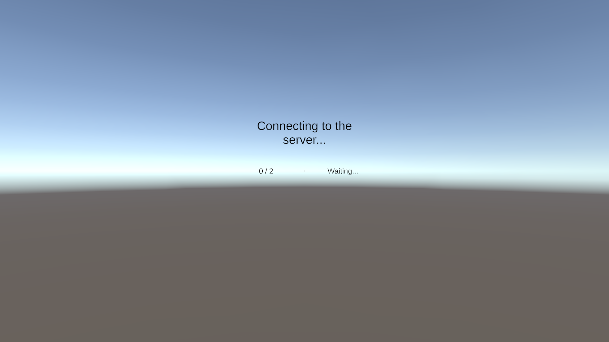
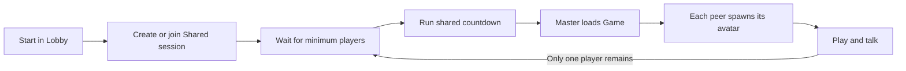
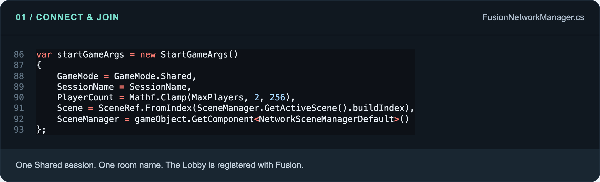
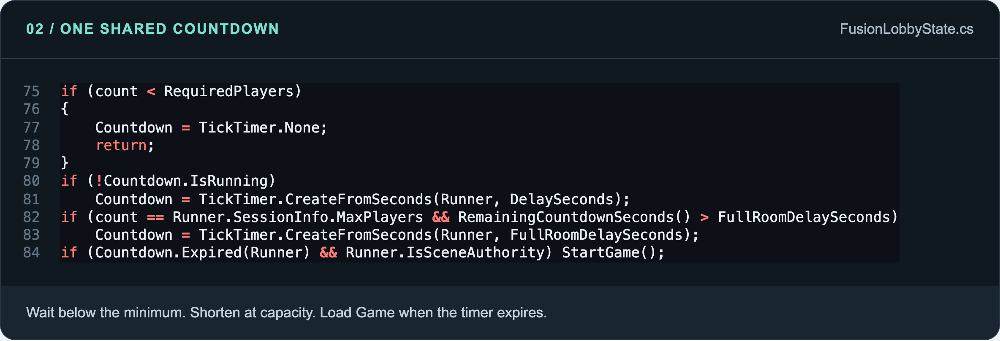
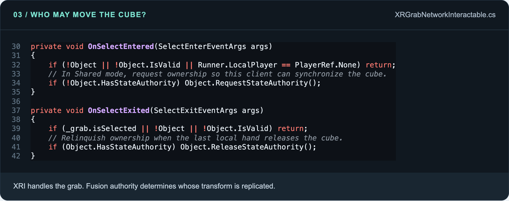
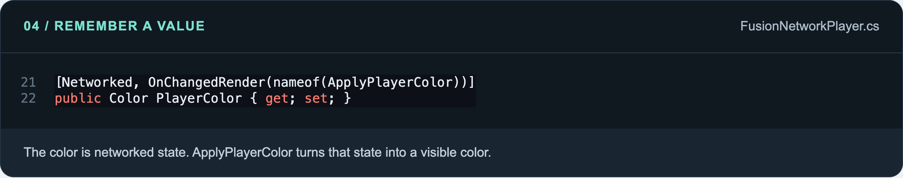
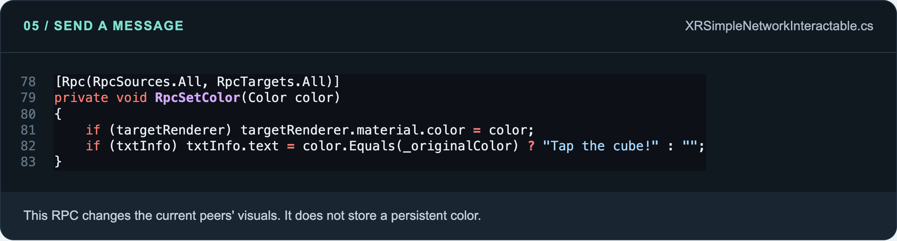
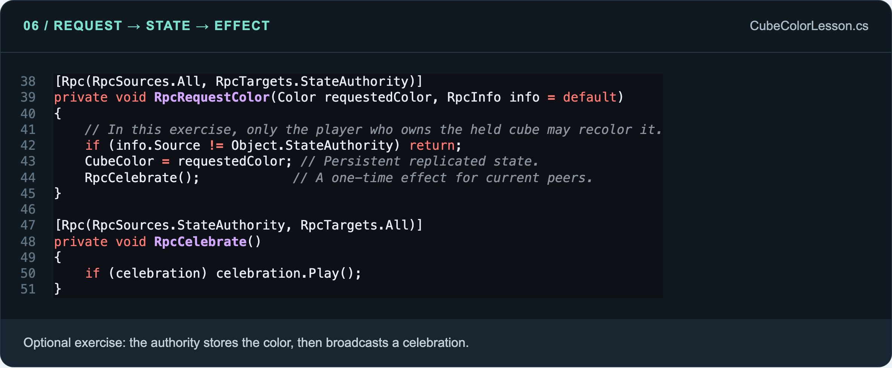

# Multiplayer VR with Photon Fusion 2, Photon Voice 2 & Unity XR

Build a small VR multiplayer experience step by step: connect to Photon, meet in a waiting room, enter the same game scene, see and hear other players, and interact with shared objects.

This project uses **Fusion 2 Shared Mode** and **XR Interaction Toolkit 3**. Each player controls their own avatar. A Shared master manages the waiting-room countdown and scene changes.


## What you will learn

1. Install Fusion and Voice, and configure their separate Photon App IDs.
2. Connect two or more players to the same session.
3. Run a shared waiting-room countdown and load Game for everyone.
4. Spawn an XR avatar and transmit microphone audio.
5. Let players grab and move a networked cube.
6. Understand the difference between a **Networked property** and an **RPC**.
7. Extend the grabbable cube with a persistent color and a one-time particle effect.

**Reading order:** [Run the project](#1-run-this-project) → [Set up your own project](#2-set-up-your-own-project) → [Waiting room](#4-how-the-waiting-room-works) → [Voice](#6-set-up-photon-voice-2) → [Grabbing](#7-network-a-grabbable-cube) → [Networked properties](#8-networked-properties-remember-the-current-value) → [RPCs](#9-rpcs-send-an-action-to-other-peers) → [Combined cube exercise](#10-exercise-use-networked-state-and-rpcs-on-the-grabbable-cube).

## 1. Run this project

### Versions used here

These are the versions recorded in this repository and its resolved Voice package, rather than a requirement to install whichever SDK is newest.

| Tool | Version |
| --- | --- |
| Unity Editor | **6000.3.23f1** |
| Photon Fusion | **2.1.3 Stable, build 2390** |
| Voice for Fusion / Photon Voice 2 | **2.63.0** |
| XR Interaction Toolkit | **3.3.2** |
| Input System | **1.20.0** |
| OpenXR Plugin | **1.16.1** |
| Universal Render Pipeline | **17.3.0** |

See [ProjectVersion.txt](ProjectSettings/ProjectVersion.txt), [Fusion build information](Assets/Photon/Fusion/build_info.txt), and [Packages/manifest.json](Packages/manifest.json). Fusion is already included under `Assets/Photon`; Package Manager resolves Voice and the Unity packages. Do not import a second copy of Fusion or add PUN to this project.

### First successful connection

1. Open the repository's root folder through **Unity Hub → Add project from disk**. Allow the packages and shaders to finish importing.
2. Create two applications in the [Photon Dashboard](https://dashboard.photonengine.com/): one for **Fusion**, and one for **Voice**. They have different App IDs.
3. In Unity, select `Assets/Photon/Fusion/Resources/PhotonAppSettings.asset`. Put your IDs into **App Id Fusion** and **App Id Voice**. 
4. Open `Assets/Scenes/Lobby Scene.unity`.
5. Select **Fusion Network Manager**. Confirm **Player Prefab** is the supplied **Network Player** prefab and **Game Scene Build Index** is `1`.
6. **Activate the player-count and countdown text GameObjects in the Lobby hierarchy.** You can find them through the manager's **Player Count Text** and **Countdown Text** references. The current scene saves these two objects inactive; the scripts update their text but do not activate those GameObjects. Leave the waiting-room panel active too.
7. In **File → Build Profiles → Scene List**, keep these enabled scenes in this exact order:

   | Build index | Scene |
   | --- | --- |
   | `0` | `Assets/Scenes/Lobby Scene.unity` |
   | `1` | `Assets/Scenes/Game Scene.unity` |

8. Build and run on two supported XR clients. Two headsets are the clearest end-to-end test. An Editor client plus a headset build is also useful, provided the Editor has working XR input or you have configured an XR simulator yourself.
9. Give both clients the same Fusion App ID, **Session Name**, app version, and region. For a controlled tutorial test, explicitly choose the same available region in Photon App Settings.
10. Start from **Lobby** on both clients and allow microphone access. The first player waits; the second fills the default two-player room; the short countdown starts; both load Game.

The Photon instructions for [Voice integration](https://doc.photonengine.com/voice/v2/getting-started/voice-for-fusion) explain the separate Voice App ID and how `FusionVoiceClient` follows the Fusion connection.

**Default room settings:** Session Name `Room 1`, Max Players `2`, Minimum Players `2`, Waiting Delay `30` seconds, Full Room Delay `5` seconds, and Player Spawn Spacing `0.7` metres.

**For three or more players:** set **Max Players** to `4` on the manager before creating a new room. Keep **Minimum Players** at `2` to demonstrate the long countdown, or set it to `3` to wait for three participants. Stop all old clients before retesting a changed capacity: a room that already exists keeps its creation settings.

> The room closes to new joins when Game begins. A third client cannot join an already-started two-player game. Configure the larger room and connect the participants during the countdown.

## 2. Set up your own project

If you are following the tutorial in a new Unity project, build the same setup in this order. If you cloned this repository, these packages and most component assignments are already present.

### Add XR first

Start with a **Universal 3D** project. Use Package Manager to install XR Interaction Toolkit, Input System, XR Plug-in Management, and OpenXR. Import the XR Interaction Toolkit **Starter Assets** sample. In **Project Settings → XR Plug-in Management**, enable OpenXR for the platform you will run, configure your headset/controller interaction profiles, and resolve the relevant Project Validation items.

Place the Starter Assets **XR Origin (XR Rig)** prefab in both scenes. Keep one active `XR Interaction Manager` and an Input Action Manager using the Starter Assets input-action asset. Test head tracking, controller tracking, and a normal local grab before adding networking. Unity's [XRI general setup guide](https://docs.unity3d.com/Packages/com.unity.xr.interaction.toolkit@3.3/manual/general-setup.html) covers the underlying XR configuration.

The current avatar script finds these exact hierarchy paths:

```text
XR Origin (XR Rig)
└── Camera Offset
    ├── Main Camera
    ├── Left Controller
    └── Right Controller
```

Keep those names when following this project. If you rename the rig or controllers, update the three paths in `FusionNetworkPlayer.Spawned()` too. The local XR Origin remains a normal scene object; the network avatar follows its tracked transforms.

### Add Fusion and Voice

1. Import the **Fusion 2 SDK**, then let Unity compile it.
2. Open **Tools → Fusion → Fusion Hub**. For Fusion 2.1, install **Voice** from the **Addons** tab, then follow its Voice setup tab.
3. Enter the two App IDs in Photon App Settings.
4. Open the supplied **Network Project Config** asset. Its `AssembliesToWeave` list includes `Assembly-CSharp`, `Assembly-CSharp-firstpass`, and `PhotonVoice.Fusion`. For a new project, follow the installed integration's setup so your gameplay assembly and Voice's Fusion assembly are woven. If you use your own `.asmdef`, include that assembly too.
5. Ensure the Network Player prefab is registered in Fusion's object table. Fusion normally detects network prefabs; use **Rebuild Object Table** on Network Project Config if the prefab is not recognized.

“Weaving” is Fusion's compile-time step that adds the synchronization code behind `[Networked]` and `[Rpc]`. The official [Voice setup](https://doc.photonengine.com/voice/v2/getting-started/voice-for-fusion) and [NetworkObject guide](https://doc.photonengine.com/fusion/v2/manual/network-object) explain these integration steps.

For a fresh project, create the five networking/hand scripts from the linked files in the [script map](#script-map), plus the two cube-interaction scripts, under `Assets/Scripts`. Use the scene and prefab checklists below to assign their references. To reuse this project's avatar assets, copy their dependent meshes, materials, animation controllers, and input-action assets as well; copying only the `.prefab` file leaves missing references. Starting with the cloned project is the easiest way to preserve those dependencies for your first successful test.

For a standalone Android headset, install **Android Build Support** through Unity Hub and enable OpenXR in the **Android** platform settings before building. For a PC-connected headset, use the matching desktop target and XR runtime. Test the target platform you intend to teach; a successful Editor run does not verify microphone permissions or XR setup in the device build.

This repository also records the Voice Git package URL in `Packages/manifest.json`:

```text
https://github.com/Photon-Server/Photon-UPM.git#fusion/v2/voice-for-fusion
```

Use one installation route. Do not install the same Voice integration again if Package Manager already shows **Voice for Fusion**.

## 3. Understand the main objects

A few terms make the scripts much easier to read:

| Term | Meaning in this tutorial |
| --- | --- |
| **Peer / client** | One running copy of the game, usually on one headset. |
| **Session / room** | The group of players connected together. Here, the default name is `Room 1`. |
| **NetworkRunner** | The component that runs the Fusion connection and simulation on this client. |
| **NetworkObject** | Gives a Unity object an identity that Fusion can match across clients. |
| **NetworkBehaviour** | Base class for scripts that use Fusion callbacks, Networked properties, or RPCs. |
| **State authority** | The peer allowed to publish an object's authoritative state. |
| **Shared master** | The selected peer that manages scene-level work in this project; another peer can take over if it leaves. |
| **Proxy** | Another client's local copy of an object whose state is owned elsewhere. |

**Authority is per object.** Player A can own their avatar while Player B owns theirs and the cube they are holding. The Shared master does not automatically drive every player's headset and hands. In this project's Shared mode, use `HasStateAuthority` when deciding who writes an avatar's state. [Photon's authority documentation](https://doc.photonengine.com/fusion/v2/manual/network-object)

### Lobby component checklist

Create a root GameObject named **Fusion Network Manager** with:

- `FusionNetworkManager`, `FusionPlayerSpawner`;
- `NetworkRunner`, `NetworkEvents`, `NetworkSceneManagerDefault`;
- `FusionVoiceClient`, `Recorder`, `VoiceLogger`.

The scripts' `RequireComponent` attributes help add the component dependencies. You still need to assign the Inspector references.

| Manager reference | Assign |
| --- | --- |
| Player Prefab | `Assets/Fusion and Essential Spawned Player Stuffs/Prefabs/Network Player.prefab` |
| Waiting Room Panel | The Lobby's waiting-room panel |
| Status Text | The connection/status TMP text |
| Player Count Text | The active TMP text for `players / capacity` |
| Countdown Text | The active TMP text for the remaining seconds |
| Lobby Canvas | The world-space canvas Transform |
| Lobby Camera | The local XR Origin's Main Camera |
| Game Scene Build Index | `1` |

The manager calls `DontDestroyOnLoad`, so the runner and Voice connection survive scene changes. Keep the XR Origin and canvas separate from that persistent object: the next scene supplies its own rig and UI.

On a **separate Lobby scene object**, add a `NetworkObject` and `FusionLobbyState`. This is the shared countdown object. It belongs to the Lobby scene and is unloaded when Game loads.

## 4. How the waiting room works



*Offline Lobby preview. The count and timer labels are enabled as described in the setup steps; no connection or countdown is being simulated in this image.*



### Connect and join



Read the complete [FusionNetworkManager.cs](Assets/Fusion%20and%20Essential%20Spawned%20Player%20Stuffs/Scripts/FusionNetworkManager.cs).

- `GameMode.Shared` selects the authority model used throughout this tutorial.
- `SessionName` identifies the room to create or join.
- `PlayerCount` supplies the capacity when creating a room.
- `Scene` registers the starting Lobby scene with Fusion.
- `SceneManager` supplies the component Fusion uses for synchronized scene loading.

`await _runner.StartGame(startGameArgs)` performs the connection/join operation. The code checks its result. A failed connection schedules a retry with a **fresh runner**; a shutdown runner is not reused.

### Share one countdown



Read [FusionLobbyState.cs](Assets/Fusion%20and%20Essential%20Spawned%20Player%20Stuffs/Scripts/FusionLobbyState.cs). Its `[Networked] TickTimer Countdown` represents a shared deadline. The UI reads the time left instead of running an unrelated local countdown on each headset.

Only the lobby object's state authority updates the timer:

| Players in a four-player room, minimum two | Result |
| --- | --- |
| One player | Wait; no active countdown. |
| Two or three players | Start the 30-second countdown. |
| Four players | Shorten the remaining wait to at most 5 seconds. |
| A player leaves, but at least two remain | Continue the existing countdown; do not extend it. |
| Fewer than two remain | Cancel the countdown and wait again. |

When the deadline expires, the scene authority closes the room and calls `Runner.LoadScene(...)`. Everyone follows the same scene change. Loading Game through a local `SceneManager.LoadScene()` on each peer would bypass this coordinated flow. [Fusion scene loading](https://doc.photonengine.com/fusion/v2/manual/scene-loading)

The lobby also assigns each participant a starting slot. `FusionPlayerSpawner` uses that slot to space the XR rigs around the Game scene's starting point. If only one player remains in Game, the scene authority returns to Lobby using the same session; the new lobby object reopens the room.

## 5. Spawn and synchronize the XR avatars

The **Network Player** prefab contains the visible avatar. The **XR Origin** contains the local tracking and input.

```text
Local XR Origin                 Network Player prefab
Main Camera       ───────────▶  Head
Left Controller   ───────────▶  Left Hand
Right Controller  ───────────▶  Right Hand
                                 │
                          Fusion replicates poses
                                 │
                          Other clients see you
```

Keep the supplied prefab for the first test. Its important pieces are:

- A root `NetworkObject` and `NetworkTransform`.
- `FusionNetworkPlayer`, with head, hand, neck, ground-marker, Animator, and input-action references assigned.
- `NetworkTransform` components for the tracked avatar parts.
- `NetworkMecanimAnimator` components for the two hand Animators.

[The spawner](Assets/Fusion%20and%20Essential%20Spawned%20Player%20Stuffs/Scripts/FusionPlayerSpawner.cs) waits for Game to finish loading, finds that scene's XR Origin, positions it at the assigned slot, and calls `Runner.Spawn` **only for the local player**. `Runner.SetPlayerObject` registers the resulting avatar and helps avoid duplicates. Fusion creates the remote copies; every client should not spawn every other player's avatar manually.

In `FusionNetworkPlayer.FixedUpdateNetwork()`, the state authority copies the headset and controller poses into the avatar and updates the hand Animator parameters. Other peers receive the synchronized transforms and animation. Local avatar renderers are hidden so the user sees the XR Origin's local hands instead of overlapping network hands.

[HandPresence.cs](Assets/Fusion%20and%20Essential%20Spawned%20Player%20Stuffs/Scripts/HandPresence.cs) is a local visual/input script. It does not send packets. Assign the corresponding left/right controller characteristics, hand-model prefab, and the **Activate Value** / **Select Value** input actions. The supplied hand prefabs already contain their action references. The rig's Input Action Manager must enable their input asset.

## 6. Set up Photon Voice 2

Fusion carries the gameplay state; Photon Voice carries microphone audio. Joining a Fusion room alone does not configure the microphone and speakers.

This project uses **one persistent primary recorder per client**. It does **not** use a `VoiceNetworkObject` on the avatar to position speech at the avatar's mouth.

| Component | Setting / purpose |
| --- | --- |
| `FusionVoiceClient` | On the same object as `NetworkRunner`; follows its room connection. |
| Use Fusion App Settings | Enabled; reads the Voice App ID from Fusion's Photon App Settings. |
| Auto Connect And Join | Enabled when a Voice App ID is configured. |
| Primary Recorder | Assign the manager's `Recorder`. The script also assigns this reference. |
| Use Primary Recorder | Enabled for this project's room-wide voice setup. |
| Speaker Prefab | Assign a prefab object with `Speaker` and `AudioSource`; the supplied scene references the Speaker child from the Network Player prefab. |
| `Recorder` source | Microphone. |
| Transmit Enabled | Enabled so captured speech is sent. |
| Voice Detection | Enabled in the supplied scene; the threshold is `0.01`. |
| Recording Enabled / Record When Joined | Initially disabled here; the manager starts recording only after permission and room readiness. |

The manager requests microphone permission on supported platforms. On Android, accept the runtime permission dialog. On macOS/iOS, also configure the relevant microphone usage description in Player Settings and allow access when asked. The source contains a permission check when the application regains focus, allowing changes made in device settings to take effect.

**Test voice separately:** connect two clients, wear headphones, speak on A, and listen on B. A's own local playback is not the normal success condition. If voice detection suppresses a quiet microphone, check the input level or temporarily disable detection while diagnosing.

For a later **positional/proximity voice** lesson, use the separate `VoiceNetworkObject` workflow and attach the Speaker to the avatar. That is a different setup from the persistent primary-recorder arrangement documented here. [Photon Voice integration reference](https://doc.photonengine.com/voice/v2/getting-started/voice-for-fusion)

## 7. Network a grabbable cube


*Game scene preview. **Grabbable Cube** teaches motion and authority. **Interactable Cube** teaches hover-triggered color RPCs. They are separate objects in the current scene.*

### Begin with a working local grab

On **Grabbable Cube**, use:

| Component | Why it is there |
| --- | --- |
| Mesh Filter / Mesh Renderer | Makes the cube visible. |
| Collider | Lets XRI find and interact with the cube. |
| `Rigidbody` | Provides the physical body used by the grab interaction. |
| `XRGrabInteractable` | Makes the object selectable and movable by an XR interactor. |
| `XRGeneralGrabTransformer` | Applies XRI's grab transforms. |
| `NetworkObject` | Gives the cube a shared identity. |
| `NetworkTransform` | Replicates movement, rotation, and configured scale. |
| `XRGrabNetworkInteractable` | Requests/releases state authority when a player grabs/releases it. |

On the cube's `NetworkObject`, enable **Allow State Authority Override** and disable **Destroy When State Authority Leaves**. The first setting allows another peer to acquire the scene cube; the second prevents an ordinary shared prop from disappearing when its last owner disconnects. These are Shared-mode choices; do not assume the same script is a Host-mode grabbing solution. [Photon's Shared VR grabbing example](https://doc.photonengine.com/fusion/v2/technical-samples/fusion-vr-shared)



Read [XRGrabNetworkInteractable.cs](Assets/Scripts/XRGrabNetworkInteractable.cs).

1. XRI raises `selectEntered` when a local interactor selects the cube.
2. The script requests state authority if this client does not already have it.
3. XRI moves the held cube; `NetworkTransform` publishes its pose from the authority.
4. The other clients display the replicated pose.
5. When the last local selecting hand releases it, the script releases authority.

**A request is not an immediate grant.** Do not write a Networked property immediately after `RequestStateAuthority()` and assume you already own the object. This is a small teaching example; competing grabs need additional authority-transfer and interaction-conflict handling. For the first demonstration, have one person grab at a time.

The saved cube uses XRI's **Kinematic** movement setting, **Throw On Detach**, and a Rigidbody with gravity. Its `NetworkTransform` synchronizes scale. Treat the first test as a held-object synchronization test, not a proof of deterministic multiplayer throwing or collision simulation.

## 8. Networked properties remember the current value

A normal C# field is local to one copy of the game. Fusion does not automatically send it to everyone.

A **Networked property** belongs to the replicated state of a `NetworkObject`. Use it for something other peers need to know now: a color, a score, a door's open state, or the current round timer. Declare it as an auto-property on a `NetworkBehaviour`. The peer with state authority writes the authoritative value. [Fusion Networked properties](https://doc.photonengine.com/fusion/v2/manual/data-transfer/networked-properties)



The current project already provides two examples:

- `FusionNetworkPlayer.PlayerColor` stores the avatar's neck color.
- `FusionLobbyState.Countdown` stores the shared timer deadline.

For `PlayerColor`, the owner chooses a color in `Spawned()`. Fusion replicates it. `OnChangedRender(nameof(ApplyPlayerColor))` asks the local client to update the visible material when the received color changes.

The script also calls `ApplyPlayerColor()` from `Spawned()`: a newly created local copy needs its initial appearance applied, even if a render-change callback has not fired. `OnChangedRender` is a presentation callback, so keep authoritative game rules outside it. [Fusion change detection](https://doc.photonengine.com/fusion/v2/manual/data-transfer/change-detection)

**Important:** the current `XRGrabNetworkInteractable` script does not declare a custom `[Networked]` color or held-state property. Its movement is synchronized by `NetworkTransform`. Section 10 adds a separate, explicit property lesson to the same cube.

## 9. RPCs send an action to other peers

An **RPC**, or remote procedure call, tells selected peers to run a method. The `[Rpc]` attribute controls **who may send** it and **where it runs**. Its name must contain an `Rpc` prefix or suffix. RPCs do not keep a history for clients that connect later. If the result must persist, store the result in a Networked property. [Fusion RPC reference](https://doc.photonengine.com/fusion/v2/manual/data-transfer/rpcs)



Read [XRSimpleNetworkInteractable.cs](Assets/Scripts/XRSimpleNetworkInteractable.cs). To recreate the separate **Interactable Cube**, add a collider, `XRSimpleInteractable`, `NetworkObject`, and this script. Assign **Target Renderer** to its Mesh Renderer, **Txt Info** to the world-space TMP prompt, and **Touch Particles** to its Particle System. Keep its shared scene object alive when its state authority leaves. The supplied scene already has these references.

During interaction:

- Local `hoverEntered` chooses a player color and calls `RpcSetColor`.
- `RpcSources.All` permits any peer with a valid copy to send this RPC.
- `RpcTargets.All` runs it on the current participating peers, including the sender with the default settings.
- The method changes the local material and prompt text on each receiving copy.
- The script's particles are deliberately controlled by **local hover events**, not by this RPC.

Despite the on-screen prompt saying “Tap the cube!”, this script listens for **hover**, not `selectEntered` or a physical tap. A configured ray or hand interactor entering hover can trigger it.

This is an **RPC-only color demonstration**. The renderer's color is not a Networked property, so a future peer would not receive the earlier color change as stored state. Also, sending this `All → All` RPC does not require the sender to own the cube; the authority request elsewhere in the script is not what permits this RPC.

| What do you want to share? | Use |
| --- | --- |
| “The cube is currently blue.” | A Networked property. |
| “Please change the cube to blue.” | An RPC request to the state authority. |
| “Play a celebration now.” | An RPC event to the relevant peers. |
| “Only my hovering hand should see these particles.” | A local method; no network message. |

## 10. Exercise: use Networked state and RPCs on the grabbable cube

This is an **optional extension**, not a component already installed in Game. It lets you teach both concepts using the same cube, without replacing the short grabbing script.

### Add the lesson

1. Copy [docs/examples/CubeColorLesson.cs](docs/examples/CubeColorLesson.cs) into `Assets/Scripts/CubeColorLesson.cs`.
2. In **Game Scene**, add `CubeColorLesson` to **Grabbable Cube**, alongside its existing components. Do this before entering Play mode so Fusion can bake the object's behaviours.
3. Optionally add a small child Particle System and assign it to **Celebration**. Disable **Play On Awake** and **Looping** so the burst only plays when requested.
4. Make sure the local XR interactor's **Activate** input is configured. With the Starter Assets controller bindings, this is usually the trigger while an object is selected.
5. Build the updated project for both clients. Grab the cube, allow the ownership transfer to complete, then press Activate.

### Follow the data

```mermaid
sequenceDiagram
    participant H as Holding player's input
    participant A as Cube's state authority
    participant P as Current peers
    H->>A: RpcRequestColor(requestedColor)
    A->>A: Validate sender; assign CubeColor
    A-->>P: Replicate CubeColor state
    P->>P: ApplyColor renders the value
    A->>P: RpcCelebrate()
    P->>P: Play the optional particle burst
```



The central property is:

```csharp
[Networked, OnChangedRender(nameof(ApplyColor))]
public Color CubeColor { get; set; }
```

The full copyable script is in [CubeColorLesson.cs](docs/examples/CubeColorLesson.cs). Read it in this order:

1. **`Spawned()`** sets the initial color on the authority and applies the current color on every peer.
2. **`OnActivated()`** reacts to local XRI input and sends `RpcRequestColor`.
3. **`RpcRequestColor()`** runs at the cube's state authority. It checks `RpcInfo.Source` against the current owner, then changes `CubeColor`.
4. **`ApplyColor()`** updates each local renderer from the replicated property.
5. **`RpcCelebrate()`** plays a one-time effect on current peers. The effect does not have to be stored as permanent state.

The sender check keeps this exercise limited to the owner of the held cube. It also makes the timing visible: activating before the grab's authority transfer finishes can be rejected. Wait for the cube to be owned before testing its trigger action. The code is a teaching example, not a complete validation system for competitive interactions.

**What a later observer should receive:** the current `CubeColor`, but no replay of old celebration RPCs. This project's normal Game session closes admission, so test late-join behavior in a separate open test session if you want to demonstrate that distinction live. The normal two-player run demonstrates the state change and event on clients already connected.

## 11. Test the tutorial in small steps

| Test | What to do | Expected result |
| --- | --- | --- |
| First player | Launch A from Lobby. | A waits; the active count label shows `1 / 2`. |
| Second player | Launch B with matching connection settings. | Both see `2 / 2`, then the short countdown. |
| Larger waiting room | Create a fresh room with Max Players `4`, Minimum Players `2`. | Two players start the long timer; filling the room shortens it. |
| Scene transition | Let the timer expire. | All current participants enter Game. |
| Avatar | Move A's head and hands. | B sees A's avatar move; A does not see duplicate avatar hands. |
| Voice | Speak on A while B listens through headphones. | B hears A in the same room. |
| Grab | A grabs and moves Grabbable Cube; then B takes a turn. | The other peer sees the held movement. |
| Existing RPC | Hover Interactable Cube. | Current peers see the color change; particles stay local to the hovering peer. |
| Optional color lesson | Hold Grabbable Cube and Activate. | Peers see its persistent color change and the optional burst. |
| Departure | Leave Game on all but one client. | The remaining player returns to Lobby and the room reopens. |
| Master departure | Leave with the current master while at least two peers remain. | The Shared session continues; another peer takes scene authority. |

Use separate processes/devices for the first test. These scripts use a singleton manager and scene-name lookups; they are not designed as a multi-runner-in-one-scene test harness.

## 12. Troubleshooting

| Symptom | Check first |
| --- | --- |
| Players each wait alone | Match Fusion App ID, app version, region, session name, and Shared mode. Confirm one client has not already entered a closed Game session. |
| A third player cannot join | Default Max Players is `2`. Change the manager setting before creating a fresh room. |
| Countdown/count labels are missing | Enable the two text GameObjects in Lobby and check the manager's TMP references. |
| Game never loads | Minimum Players must be reachable; the Lobby needs its `FusionLobbyState` scene NetworkObject; scene indices must match the enabled Build Profile list. |
| No avatar or spawn error | Assign Network Player on the manager, register the prefab in Fusion's object table, and start through Lobby rather than opening Game directly. |
| Avatar rig lookup throws | Restore the exact XR hierarchy names listed in section 2. |
| Hands do not animate | Check left/right action references, enabled input assets, local hand Animator assignments, and the network prefab's NetworkMecanimAnimator references. |
| Only one peer can move the cube | Check Shared mode and Allow State Authority Override; wait for ownership transfer before testing another action. |
| Held cube jitters when both players grab it | Test one grabber at a time; this minimal script does not resolve competing selections. |
| Voice is silent | Check Voice App ID, room connection, microphone permission, Primary Recorder, Transmit Enabled, voice-detection threshold, Speaker prefab, and audio output. |
| Old cube color is missing after a late join | The original Interactable Cube uses RPC-only visuals. Use the optional Networked-property exercise for persistent color. |
| Optional celebration is absent | Assign a Particle System, disable its Play On Awake/Looping, and verify Activate is bound while holding the object. |
| Networked property / RPC compilation problems | Derive from NetworkBehaviour, use a NetworkObject, keep `[Networked]` auto-properties, and check Fusion's assemblies-to-weave configuration. |

## Script map

| Script | Main responsibility |
| --- | --- |
| [FusionNetworkManager](Assets/Fusion%20and%20Essential%20Spawned%20Player%20Stuffs/Scripts/FusionNetworkManager.cs) | Connect/join, lobby UI, reconnect, Voice and microphone startup. |
| [FusionLobbyState](Assets/Fusion%20and%20Essential%20Spawned%20Player%20Stuffs/Scripts/FusionLobbyState.cs) | Shared room rules, timer, spawn slots, and transition to Game. |
| [FusionPlayerSpawner](Assets/Fusion%20and%20Essential%20Spawned%20Player%20Stuffs/Scripts/FusionPlayerSpawner.cs) | Spawn the local avatar, space players, and return the last player to Lobby. |
| [FusionNetworkPlayer](Assets/Fusion%20and%20Essential%20Spawned%20Player%20Stuffs/Scripts/FusionNetworkPlayer.cs) | Copy local tracking into the network avatar and apply player color. |
| [HandPresence](Assets/Fusion%20and%20Essential%20Spawned%20Player%20Stuffs/Scripts/HandPresence.cs) | Show and animate the local hand/controller models. |
| [XRGrabNetworkInteractable](Assets/Scripts/XRGrabNetworkInteractable.cs) | Request/release the grabbable object's state authority. |
| [XRSimpleNetworkInteractable](Assets/Scripts/XRSimpleNetworkInteractable.cs) | Hover-driven color RPC and local particles. |
| [CubeColorLesson — optional](docs/examples/CubeColorLesson.cs) | Add persistent cube color, an authority-targeted request, and a transient celebration. |

For screenshot provenance and code-image regeneration, see [docs/images/README.md](docs/images/README.md).
