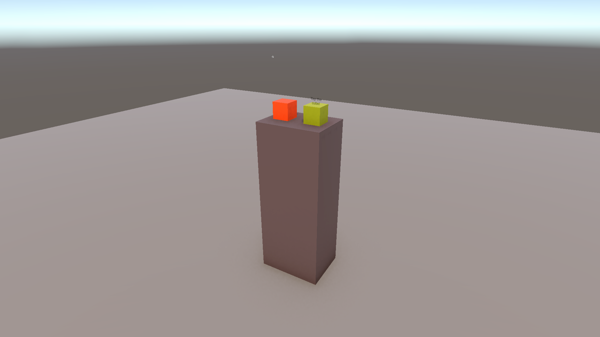
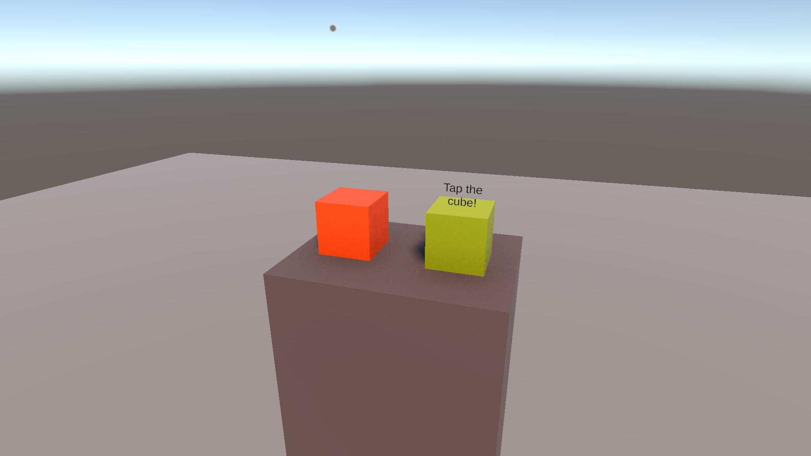

# Learn Photon Fusion by building a multiplayer VR game

Imagine opening a VR game, meeting a friend in a waiting room, and entering a shared play space together. You can see their hands move, hear them speak, and pass a cube between you. This project builds that experience with **Photon Fusion** for networking, **Photon Voice** for speech, and **XR Interaction Toolkit (XRI)** for VR interactions.

Follow that journey through the networking ideas, Unity setup, and scripts that make it work. Basic Unity and C# knowledge helps; no previous Photon experience is needed.



## 1. Give the game somewhere to connect

Before players can meet, their games need to connect to the same Photon application. Create a **Fusion** application in the [Photon Dashboard](https://dashboard.photonengine.com/) and put its ID into **App Id Fusion** in `Assets/Photon/Fusion/Resources/PhotonAppSettings.asset`. If you want voice chat, create a separate **Voice** application and fill **App Id Voice** too.

Open this project through Unity Hub and let importing finish. Fusion is included. The project uses Unity **6000.3.23f1**, Fusion **2.1.3**, Voice **2.63.0**, and XRI **3.3.2**.

Our game has two scenes: **Lobby Scene**, where players wait, and **Game Scene**, where they interact. Open `Assets/Scenes/Lobby Scene.unity`. In **Build Profiles → Scene List**, keep Lobby at index `0` and Game at `1`; the scripts use those indices when loading scenes.

Each player's device runs its own copy of Unity. Networking shares selected information so both see the same experience. We call our device **local** and the other player's device **remote**; each connected device is a **client** or **peer**.

To bring those clients into one room, we use the `NetworkRunner` component on **Fusion Network Manager**. It manages the local connection and network simulation. [FusionNetworkManager.cs](Assets/Fusion%20and%20Essential%20Spawned%20Player%20Stuffs/Scripts/FusionNetworkManager.cs) starts it with a call like this:

```csharp
var result = await runner.StartGame(new StartGameArgs {
    GameMode = GameMode.Shared,
    SessionName = SessionName,
    PlayerCount = MaxPlayers,
    Scene = SceneRef.FromIndex(0),
    SceneManager = GetComponent<NetworkSceneManagerDefault>()
});
```

In **Shared mode**, this creates the named room if needed or joins it if it already exists. `SessionName` identifies the room and `PlayerCount` sets its capacity—**two players by default** here. The method is `async`: `await` allows Unity to keep running while connection work finishes. `result.Ok` tells us whether startup succeeded.

The manager is an ordinary Unity `MonoBehaviour`, initialized through `Awake` and `Start`. Its `NetworkEvents` component provides **callbacks**: methods invoked when something happens, such as connecting, a player joining, or a shutdown. The script listens directly to these events to update status and detect failures. If the connection fails, it waits five seconds and reloads Lobby with a new runner, because a stopped runner cannot be reused. This is a fresh join attempt, not restoration of the old player.

The manager also needs `NetworkSceneManagerDefault`. Assign the supplied [Fusion Player Spawner and Lobby Controller prefab](Assets/Fusion%20and%20Essential%20Spawned%20Player%20Stuffs/Prefabs/Fusion%20Player%20Spawner%20and%20Lobby%20Controller.prefab) to the manager's **Player Spawner Prefab** field. A prefab is a reusable object template; this one contains a `NetworkObject` and `FusionPlayerSpawnerAndLobbyController`. Configure the player prefab, scene indices, spacing, and countdown directly on that prefab; the manager does not assign those settings. Neither scene needs a controller placed in its hierarchy. Our Lobby Scene is a waiting area **inside the room**; it is separate from Photon's matchmaking lobby used to discover rooms.

## 2. Wait for a friend, then leave together

The first player waits until their friend arrives, then both should see the same countdown. Independent timers could disagree, so one device must decide when to start and share that decision.

Fusion calls permission to update a network object's state **state authority**. In Shared mode, players can have authority over different objects. One player also becomes the **Shared master client**; this project gives that role responsibility for the waiting-room state and scene changes. Another player takes over if the master leaves. The master is not a server hosting everyone's simulation.

Once the room and initial scene are ready, the master spawns one **Fusion Player Spawner and Lobby Controller** network prefab. Fusion sends its copy to every client. The `DontDestroyOnLoad` spawn flag keeps it across scene changes, and `SharedModeStateAuthMasterClient` makes authority follow the master role. Its `NetworkObject` also has **Is Master Client Object** enabled and **Destroy When State Authority Leaves** disabled. This persistent coordinator is separate from the personal avatars it creates. Other scripts can access the local copy through `FusionPlayerSpawnerAndLobbyController.Instance` after it has spawned; that reference is null before then. `Instance` is a local shortcut, while Fusion synchronizes the `[Networked]` properties.

Its `NetworkObject` gives it a network identity. [FusionPlayerSpawnerAndLobbyController.cs](Assets/Fusion%20and%20Essential%20Spawned%20Player%20Stuffs/Scripts/FusionPlayerSpawnerAndLobbyController.cs) derives from `NetworkBehaviour`, allowing Fusion callbacks and shared properties such as:

```csharp
[Networked] public float CountdownEndTime { get; set; }
```

`[Networked]` tells Fusion to synchronize this property's value. Here, a plain `float` stores the deadline: `Runner.SimulationTime + delay`. Zero means we are still waiting. Each client displays `CountdownEndTime - Runner.SimulationTime`, clamped to zero. Using [Fusion's simulation clock](https://doc.photonengine.com/fusion/v2/concepts-and-patterns/network-simulation-loop) gives the countdown a common time reference across devices. Only the object's state authority sets the deadline; the script keeps that authority with the Shared master. Filling the room can shorten the deadline, but never extend it.

When Fusion makes the object ready, `Spawned()` subscribes to `NetworkEvents`, waits for the local scene to be ready, and includes players already in the room. A joining client may still be loading even when the master is ready. On later scene changes, `SceneLoaded` waits for loading to finish before creating the replacement avatars. Both `PlayerJoined` and `PlayerLeft` call `PlayersChanged`, which updates slots and checks whether a lone player should return to Lobby. Then `FixedUpdateNetwork()` checks the player count and deadline on Fusion's simulation ticks, which are distinct from Unity's `FixedUpdate` frames. Events tell us someone arrived; these checks implement our rule for when to begin.

Keep **Max Players = 2** on the manager. On the controller prefab, keep **Minimum Players = 2**, **Waiting Delay = 30**, **Full Room Delay = 5**, **Lobby Scene Build Index = 0**, and **Game Scene Build Index = 1**. The second player fills our default room, so the countdown becomes five seconds. To try the four-player example, create a fresh room with Max Players set to `4`: two players start a 30-second wait, and filling the room shortens the remaining time to at most five seconds. Dropping below two cancels the countdown.

Assign the waiting-room status, player-count, and countdown texts on `FusionNetworkManager`, along with its lobby canvas and camera. `SetStatus` writes connection messages directly to the status text. The spawner’s `Render` callback updates the player count and shared countdown each frame, using those UI references. The manager’s `LateUpdate` places each new lobby panel **1 metre horizontally ahead of the headset and 1 metre above the floor**, once (using its left/right heading, not its upward/downward tilt; the scene floor is at world `y = 0`), and enables recording when voice is ready. After placement, the panel stays at that world position: you can look away without it following your gaze. The enabled `CanvasController` only rotates it to face your camera as you move. Adjust **Lobby Canvas Distance** and **Lobby Canvas Height Above Ground** on the manager to change the initial placement. Both default to `1` metre. When Lobby reloads, its new manager passes these fresh UI references to the surviving manager before removing itself. At expiry, the scene authority closes admission and calls `Runner.LoadScene(...)`; `NetworkSceneManagerDefault` coordinates everyone's move into Game. Before that journey feels like multiplayer, though, we need to make the people in the room visible.

## 3. Turn tracked headsets into recognizable players

The **XR Origin** follows your headset and controllers locally. Your friend needs a visible body that follows those movements, so we create a separate **network avatar** from the **Network Player** prefab.

A `NetworkObject` identifies the avatar but does not synchronize its movement or appearance. On the **Network Player** prefab, we choose what to share:

| Component | What it does here |
| --- | --- |
| `NetworkObject` | Identifies the avatar. Enable **Destroy When State Authority Leaves** and disable **Allow State Authority Override**, because it belongs to one player. |
| `NetworkTransform` | Shares position and rotation on the root and independently moving tracked parts. |
| `NetworkMecanimAnimator` | Shares hand animation parameters. Assign the hand's **Animator**, not an animation clip. |
| `FusionNetworkPlayer` | Connects the avatar's head, hands, torso, ground contact, and hand animations to local tracking and input. |

Assign those references and the grip/trigger actions on `FusionNetworkPlayer`. Both scenes need a working XR rig with these exact paths, which the script uses to find tracking objects:

```text
XR Origin (XR Rig)/Camera Offset/
    Main Camera
    Left Controller
    Right Controller
```

Check that **Network Player** and **Fusion Player Spawner and Lobby Controller** appear in Fusion's Network Project Config prefab table; rebuild the table if needed. Other clients need to resolve both prefabs when they are spawned.

[FusionPlayerSpawnerAndLobbyController.cs](Assets/Fusion%20and%20Essential%20Spawned%20Player%20Stuffs/Scripts/FusionPlayerSpawnerAndLobbyController.cs) now has two related jobs: coordinate the shared room and create each client's avatar. There are therefore two different `Spawn` calls: the manager creates the single persistent controller, and the controller creates player avatars. Its `SpawnPlayer` method always uses `Runner.LocalPlayer`, so each device creates only its own avatar:

```csharp
var avatar = Runner.Spawn(PlayerPrefab, rig.transform.position, rig.transform.rotation);
Runner.SetPlayerObject(Runner.LocalPlayer, avatar);
```

Assign **Network Player** to **Player Prefab** on the controller prefab, with **Player Spawn Spacing = 0.7**. A join can arrive before the shared slot. `OnChangedRender(nameof(SpawnPlayer))` on the slot array tries spawning when that data arrives. `SceneLoading` despawns our old avatar because it follows the old scene's XR rig. `if (avatar)` checks that one exists; despawning does not disconnect the player. The controller survives, and `SceneLoaded` waits for Fusion to finish loading before spawning our replacement avatar against the new rig. Unlike ordinary `Instantiate`, `Runner.Spawn` creates a network object that other clients also receive. `SetPlayerObject` associates it with our `PlayerRef`, Fusion's player identifier, so later scripts can find our avatar. `Runner.Despawn` removes a network object.

Inside [FusionNetworkPlayer.cs](Assets/Fusion%20and%20Essential%20Spawned%20Player%20Stuffs/Scripts/FusionNetworkPlayer.cs), `FixedUpdateNetwork()` first checks `HasStateAuthority`. Only our own avatar should copy our headset and controller poses. Its torso and ground contact follow with offsets, and grip/trigger inputs drive its hand animations. The networking components then carry those updates to our friend.

Our own visible hands are handled separately by [HandPresence.cs](Assets/Fusion%20and%20Essential%20Spawned%20Player%20Stuffs/Scripts/HandPresence.cs), which finds a local controller and switches between its model and an animated hand. [CanvasController.cs](Assets/Scripts/CanvasController.cs) turns its attached world-space text toward the assigned camera. Both are local Unity behaviors and send no network messages.

Movement tells us where someone is; torso color helps us recognize who they are:

```csharp
[Networked, OnChangedRender(nameof(ApplyPlayerColor))]
public Color PlayerColor { get; set; }
```

The authority assigns a color and Fusion shares the property. `OnChangedRender` names the method that applies a changed value to the visible material; `nameof` supplies that method's name. We also call `ApplyPlayerColor()` in `Spawned()`, because the change callback does not handle the initial spawn.

The spawner assigns separate starting slots, spaced **0.7 metres** apart, so avatars do not appear on top of one another. `SpawnPlayers` is a fixed-size `NetworkArray<PlayerRef>`: it stores player IDs in numbered slots, not avatar objects. We use `Set` to fill an empty slot rather than `Add`. In `PlayersChanged`, the first `Contains` check clears slots belonging to departed players; the second assigns slots to connected players who do not have one. The persistent controller keeps its networked slot array when entering Game and creates replacement avatars in those slots using the new scene's rig. Returning to Lobby resets the slots for the next group. The same player identifier produces the same torso color, so players remain recognizable. Their previous walking positions are not carried into the new scene.

These scripts use `using Fusion;` to access Fusion types. Keep `Assembly-CSharp` in Network Project Config's assemblies-to-weave list: Fusion's **weaver** generates the synchronization code behind `[Networked]` and, later, `[Rpc]`.

## 4. Let those players talk

We can now see our friend, but movement updates do not carry speech. Photon Voice handles that separately while following the Fusion session.

On the manager, use `FusionVoiceClient`, `Recorder`, and `VoiceLogger`. Configure them as follows:

1. Set Recorder to **Microphone** and enable **Transmit Enabled**.
2. Enable **Use Fusion App Settings** and **Use Primary Recorder** on FusionVoiceClient; drag the Recorder into **Primary Recorder**.
3. Assign **Speaker Prefab** to an object with `Speaker` and `AudioSource`. The supplied scene uses the Speaker child of the avatar prefab as its template.

The Recorder captures our speech; the Speaker plays speech received from another player. `FusionNetworkManager` requests microphone permission, enables recording only when Fusion and Voice are ready, and stops voice during reconnection or shutdown. Leaving the Voice App ID empty disables voice. This example provides room-wide voice; see [Photon's Voice setup](https://doc.photonengine.com/voice/v2/getting-started/voice-for-fusion) for further configuration.

## 5. Share something both players can grab

Once the countdown takes us into Game, the orange cube introduces a new problem. An avatar always belongs to its player, but either player should be able to move this cube. Its state authority therefore needs to change hands.



On **Grabbable Cube**, use a collider, `Rigidbody`, `XRGrabInteractable`, `XRGeneralGrabTransformer`, `NetworkObject`, `NetworkTransform`, and [XRGrabNetworkInteractable.cs](Assets/Scripts/XRGrabNetworkInteractable.cs). Enable **Allow State Authority Override** so another player can take control, and disable **Destroy When State Authority Leaves** so the shared prop survives their departure.

XRI raises `selectEntered` when a hand grabs the cube. If we do not already control it, the script requests authority:

```csharp
if (HasStateAuthority) return;
Object.RequestStateAuthority();
```

Once authority arrives, `NetworkTransform` shares the position, rotation, and scale produced by XRI. After the last local hand releases the cube, the script restores a dynamic Rigidbody and **keeps authority**, so gravity and the throw continue to be synchronized. The next grabber can request authority because override is enabled.

A request is not an immediate grant. `StateAuthorityChanged` restores physics if authority arrives after a quick release. This also avoids leaving the cube kinematic because XRI recorded its remote-proxy state before ownership changed. There is only one state authority at a time, not shared control by everyone. For two-hand resizing, set **Select Mode = Multiple** and **Track Scale** on `XRGrabInteractable`, enable **Allow Two Handed Scaling** on `XRGeneralGrabTransformer`, and enable **Sync Scale** on `NetworkTransform`. These are configured on the supplied cube. One player grips it with both hands and moves them apart/together; everyone sees the uniform scale change. Scaling is clamped to **0.25–2 times** the initial size. This supports one player manipulating the cube at a time, not two different players jointly controlling it.

## 6. Make an interaction visible to everyone

The yellow-green cube uses the torso color we assigned earlier. When we hover over it, everyone should see it match our color and hide its prompt. Only we should see the hover particles.

Here we introduce an **RPC**, or **remote procedure call**: a request for selected clients to execute a method. Our avatar's networked property shares a current value; this RPC sends a color-changing action to the players currently present.

On **Interactable Cube**, use a collider, `XRSimpleInteractable`, `NetworkObject`, and [XRSimpleNetworkInteractable.cs](Assets/Scripts/XRSimpleNetworkInteractable.cs). Assign the renderer, text prompt, and particle system, and keep the object alive when its authority leaves.

In `hoverEntered`, the script finds our avatar with `Runner.GetPlayerObject(Runner.LocalPlayer)`, reads its `PlayerColor`, and passes that color to:

```csharp
[Rpc(RpcSources.All, RpcTargets.All)]
private void RpcSetColor(Color color)
{
    if (targetRenderer) targetRenderer.material.color = color;
    if (txtInfo) txtInfo.text = color.Equals(_originalColor) ? "Tap the cube!" : "";
}
```

`RpcSources.All` allows any peer with this object to send the call; `RpcTargets.All` executes it on current peers, including the sender. No authority transfer is needed for this RPC. Fusion recognizes RPC methods by the attribute and an `Rpc` prefix or suffix in their name.

The last local `hoverExited` sends the original color back, restoring the prompt too. Hover may come from a nearby hand or a ray. Particle playback stays in the local hover handlers, outside the RPC, so our friend sees the color change without seeing our particles.

This also shows the limit of an RPC: it has no persistent history for someone joining later. If a changed color must survive for future arrivals, store it in a networked property. Here, overlapping hovers simply use the last received event.

## 7. Complete the journey

Finally, our friend leaves. The spawner handles `PlayerLeft` through `PlayersChanged`, which checks whether only one player remains in Game. The scene authority returns that player to Lobby, where the spawner resets the countdown and slots and reopens admission in its `SceneLoaded` event handler. The same player check runs after loading and when the spawner receives `StateAuthorityChanged`, so the new master can continue the normal flow. The remaining player can now wait for someone else, completing the same loop we began with.

Try that whole journey with two clients and working VR input: **join → wait → enter Game → talk → grab → hover → leave**. Use matching App IDs, region, app version, session name, scene indices, timer settings, and spacing. Inspector settings are local configuration; the countdown and slots are shared state. If players wait alone, compare connection settings. For silent voice, check the Voice ID, microphone permission, Recorder, and Speaker assignments.

The seven linked tutorial scripts include comments explaining each method, its main steps, and crucial lines. Read them in this order alongside Photon's [Shared Mode Basics](https://doc.photonengine.com/fusion/v2/tutorials/shared-mode-basics/2-scene-and-player) to follow the same journey in code.

Screenshots are offline Unity scene previews using the saved materials. See [image sources](docs/images/README.md) and the [interactable-cube close-up](docs/images/interactable-cube.png).
